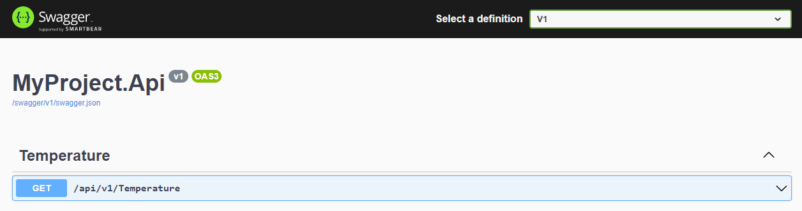

# Example client/server soap <!-- omit in toc -->

## Contents <!-- omit in toc -->

- [1. What is this project](#1-what-is-this-project)
- [2. How is it organized](#2-how-is-it-organized)
  - [2.1. Result ApiVersioning](#21-result-apiversioning)
  - [2.2. Result ApiVersioningWithSwagger](#22-result-apiversioningwithswagger)

# 1. What is this project

- This is a project that shows how to versioning apis.

# 2. How is it organized

- ApiVersioning (.NET 6.0 / REST Client / Without swagget)
- ApiVersioningWithSwagger (.NET 6.0 / REST Client / With swagger)

## 2.1. Result ApiVersioning

|                                   |                                                                                      |
| --------------------------------- | ------------------------------------------------------------------------------------ |
| Query String Parameter Versioning |  |
| Media/Header API Versioning       |            |
| Media/Header API Versioning       |      |
| URI Versioning                    |                              |
| Project                           | [ApiVersioning](ApiVersioning/)                                                      |

## 2.2. Result ApiVersioningWithSwagger

|         |                                                       |
| ------- | ----------------------------------------------------- |
| v1      |          |
| v2      |          |
| Project | [ApiVersioningWithSwagger](ApiVersioningWithSwagger/) |
